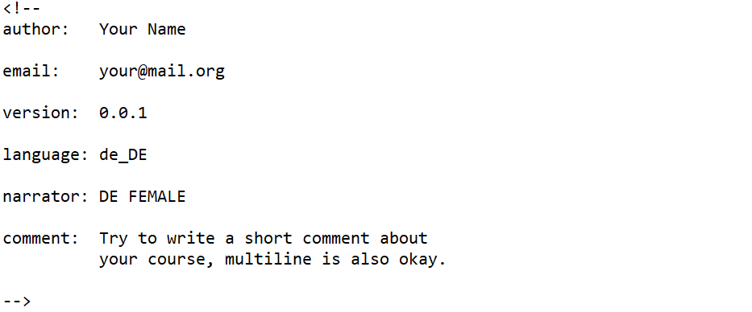
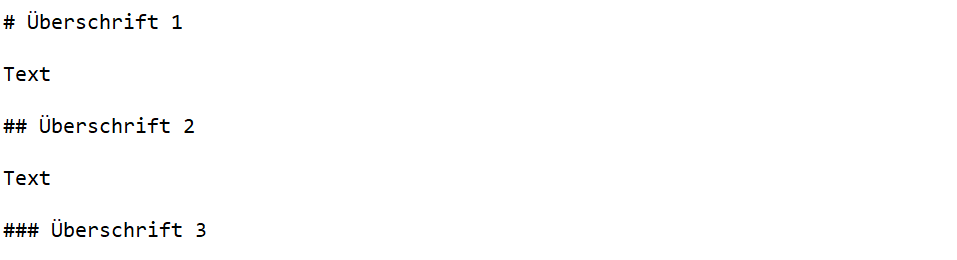
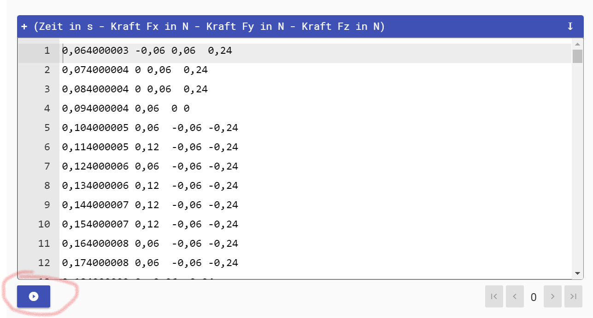
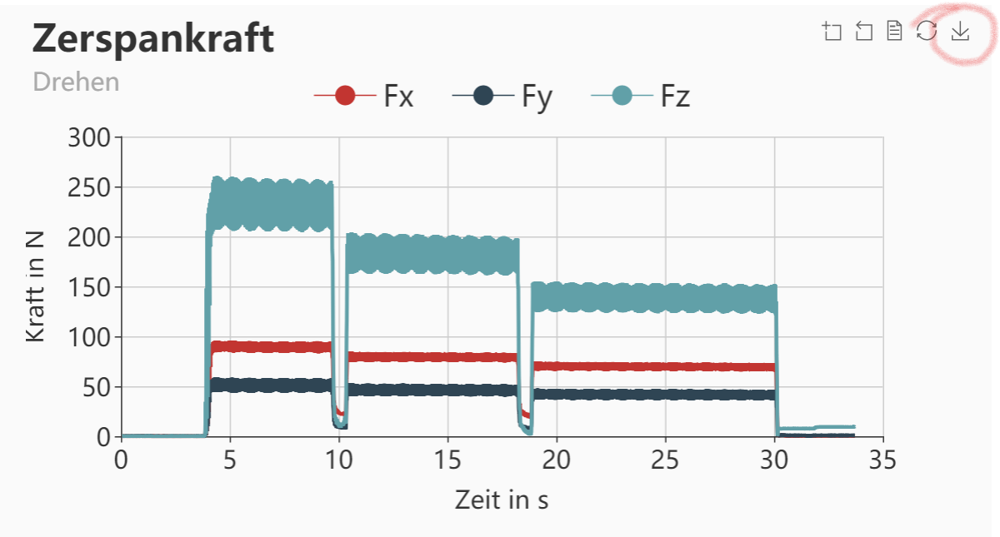

<!--
author:   Nancy Brinkmann, Ronny Stolze

email:    nancy.brinkmann@h2.de, ronny.stolze@h2.de

version:  1.0.0

language: de_DE

narrator: DE FEMALE

comment:  Try to write a short comment about
          your course, multiline is also okay.

script:  https://cdnjs.cloudflare.com/ajax/libs/echarts/4.2.1/echarts-en.js
-->

# Allgemeines

Dieses kurze Tutorial soll Sie bei der Erstellung und Bearbeitung Ihrer Kurse mit Hilfe des Tools LIA-Script unterstützen. Außerdem wird Ihnen aufgezeigt, welche Daten Sie in Ihre Kurse einbinden können und welche Möglichkeiten sich bieten, diese darzustellen.

Fortgeschrittene können sich direkt zur Webseite [LIA-Script](https://liascript.github.io/) bzw. zur [Dokumentation](https://liascript.github.io/course/?https://raw.githubusercontent.com/liaScript/docs/master/README.md#1) begeben und sich dort umsehen. Hier finden Sie die komplette (englische) Beschreibung zum Aufbau eines Kurses.

<br>
<br>
Bei Fragen wenden Sie sich gern an: *nancy.brinkmann(at)h2.de* oder *ronny.stolze(at)h2.de*.

# (Schnell-)Start

[Die folgende Beschreibung stellt lediglich einen ~~kurzen~~ Einblick in die Erstellung eines Kurses mit LIA-Script dar. An dieser Stelle sei noch einmal auf die komplette (englische) Beschreibung und Auflistung der Möglichkeiten mit [LIA-Script](https://liascript.github.io/course/?https://raw.githubusercontent.com/liaScript/docs/master/README.md#1) verwiesen.]

----

<br>
Zunächst benötigen Sie eine Textdatei, in der Sie Ihren gesamten Kurs aufbauen. Zum Erstellen und Bearbeiten dieser eignet sich z.B. der Editor [Atom](https://atom.io/). Denn hier haben Sie  mithilfe von aktuell zwei LIA-Script [Plugins](https://atom.io/packages) die Möglichkeit, eine Preview Ihres Kurses anzusehen.


Zurück zur Textdatei. Ihre Textdatei versehen Sie mit folgendem Kopf:

<!--
style = "border: 0.5px solid; width: 80%; "
-->

Tragen Sie hier Ihren Namen und Ihre E-Mail Adresse sowie einen kleinen Kommentar zu Ihrem Kurs ein.

Nun können Sie Ihr Inhaltsverzeichnis einfügen, indem Sie vor jede Überschrift ein # setzen, und vor jede weitere Überschrift, die der oberen zuzuordnen ist zwei ##, usw. Zwischen Ihre Überschriften platzieren Sie ihre Texte, [Bilder](#4), [Videos](#5) oder [Links](#6).

<!--
style = "border: 0.5px solid; width: 80%; "
-->

Die Überschriften unterteilen Ihren Kurs in Seiten. Durch diese können Sie entweder mit einem Klick auf die jeweilige Überschrift im Inhaltsverzeichnis oder mit den Pfeiltasten oben neben der Seitenzahl navigieren.

Nach dem Speichern (Strg+S) der Datei, öffnen Sie die Preview (Alt+L). In dieser sehen Sie nun links Ihr Inhaltsverzeichnis. Das können Sie natürlich auch nach und nach anlegen und immer wieder editieren.


<br>

<!--
style = "color: red; width: 100%; "
-->
Die Vorlage einbinden oder darauf verweisen?


# **Einbinden von Medien**

## Bilder

## Videos

## Links


# **Visualisieren von Messdaten**

Nachfolgend finden Sie einige Möglichkeiten, Messdaten aus Textdateien zu visualisieren. In den [Vorlagen-Tabellen](#8) befinden sich Beispieldaten zur Veranschaulichung der jeweiligen Visualisierung. Diese Daten ersetzen Sie ganz einfach durch Ihre Daten, indem Sie die Beispieldaten löschen ...

<!--
style = "width: 100%; "
-->

...  und Ihre Daten hineinkopieren.

<!--
style = "width: 100%; "
-->

Ein Klick auf den Pfeil unten links macht aus Ihren Daten ein Diagramm. Dieses können Sie als Bilddatei herunterladen (rechts über dem Diagramm: Pfeil nach unten) und speichern. Um einzelne Graphen auszublenden, klicken Sie auf das jeweilige Symbol in der Legende.

<!--
style = "width: 100%; "
-->

Wenn Sie weitere Daten einlesen möchten, löschen Sie die vorherigen Daten aus dem Eingabefeld, kopieren Ihre neuen Daten hinein und führen die Visualisierung wie oben beschrieben durch. Rechts unter dem Eingabefeld befinden sich Pfeile, mit Hilfe derer sie zu allen eingegebenen Daten navigieren können. Für die neue Visualisierung ist jeweils ein Klick auf den Pfeil links unter dem Eingabefeld notwendig.


## Zerspankräfte Drehen

``` cvs (Zeit in s - Kraft Fx in N - Kraft Fy in N - Kraft Fz in N)
0;1,5;2,4;0,2
1;1,8;2,1;0,5
2;1,1;2,9;0,8
```
<script>
let data = `@input`.replace(/,/g, ".");

let split = data.match(/\d+(?:\.\d+)?|\-\d+(?:\.\d+)?/g);
//document.write(split);
let T = []
let Fx = []
let Fy = []
let Fz = []

for(let i=0; i<split.length; i=i+4) {
  T.push(parseFloat(split[i]));
  Fx.push(parseFloat(split[i+1]));
  Fy.push(parseFloat(split[i+2]));
  Fz.push(parseFloat(split[i+3]));
}

plotData(T, Fx, Fy, Fz);

function plotData(t, x, y, z) {

  let main = document.getElementById('main');
  main.hidden = false;

  let fx = []
  let fy = []
  let fz = []

  for(let i=0; i<t.length; i++) {
    fx.push([t[i], x[i]])
    fy.push([t[i], y[i]])
    fz.push([t[i], z[i]])
  }

  let chart = echarts.init(main);

  let option = {

    title : {
      display: false,
      text: "Zerspankraft",
      subtext: 'Drehen',
      itemGap: 10,
      textAlign: 'auto',
      textVerticalAlign: 'middle',
      textStyle: {
        fontSize: 30,
      },
      subtextStyle: {
        fontSize: 20,
      },
    },

    grid: {
      top: 120,
    },

    legend: {
        data:['Fx', 'Fy', 'Fz'],
        top: 80,
        itemGap: 30,
        itemWidth: 50,
        itemHeight: 20,
        textStyle: {
          fontSize: 24,
        },
    },

    toolbox: {
      show : true,
      feature : {
        mark : {show: true},
        dataZoom : {show: true},
        dataView : {show: true, readOnly: false},
        restore : {show: true},
        saveAsImage : {
          show: true,
          pixelRatio: 4,
        },
      },
    },

    xAxis: [{
      type: 'value',
      name: 'Zeit in s',
      nameLocation: 'middle',
      nameGap: 40,
      axisLabel: {
        fontSize: 20,
      },
      nameTextStyle: {
        fontSize: 20,
      },
    }],

    yAxis: [{
      type : 'value',
      name: 'Kraft in N',
      nameLocation: 'middle',
      nameGap: 60,
      axisLabel: {
        fontSize: 20,
      },
      nameTextStyle: {
        fontSize: 20,
      },
    }],


    series : [{
      name:'Fx',
      type:'line',
      data: fx,
      symbol: 'none',
      lineStyle: {
        width: 3,
      },
    },
    {
      name:'Fy',
      type:'line',
      data: fy,
      symbol: 'none',
      lineStyle: {
        width: 3,
      },
    },
    {
      name:'Fz',
      type:'line',
      data: fz,
      symbol: 'none',
      lineStyle: {
        width: 3,
      },
    }]
  };

  // use configuration item and data specified to show chart
  chart.setOption(option);

  window.addEventListener('resize', chart.resize);
}
</script>


<div id="main" style="position:relative; width:100%; height:600%;" hidden="true"></div>


##Rauheit Kenngrößen

``` cvs (Messung - Ra in µm - Rz in µm - Rmax in µm)
1 0,5;2,1;2,5
2;0,8;3,0;3,3
3;0,6;2,5;2,9
```
<script>
let data1 = `@input`.replace(/,/g, ".");

let split1 = data1.match(/\d+(?:\.\d+)?|\-\d+(?:\.\d+)?/g);
//document.write(split1);
let M = []
let Ra = []
let Rz = []
let Rmax = []

for(let i=0; i<split1.length; i=i+4) {
  M.push(parseFloat(split1[i]));
  Ra.push(parseFloat(split1[i+1]));
  Rz.push(parseFloat(split1[i+2]));
  Rmax.push(parseFloat(split1[i+3]));
};

plotData(M, Ra, Rz, Rmax);

function plotData(t1, x1, y1, z1) {

  let main1 = document.getElementById('main1');
  main1.hidden = false;

  let ra = []
  let rz = []
  let rmax = []

  for(let i=0; i<t1.length; i++) {
    ra.push([t1[i], x1[i]])
    rz.push([t1[i], y1[i]])
    rmax.push([t1[i], z1[i]])
  }

  let chart1 = echarts.init(main1);

  let option1 = {

    title : {
      display: false,
      text: "Rauheit",
      subtext: 'Kenngrößen',
      itemGap: 10,
      textAlign: 'auto',
      textVerticalAlign: 'middle',
      textStyle: {
        fontSize: 30,
      },
      subtextStyle: {
        fontSize: 20,
      },
    },

    grid: {
      top: 120,
    },

    legend: {
        data:['Ra', 'Rz', 'Rmax'],
        top: 80,
        itemGap: 40,
        itemWidth: 50,
        itemHeight: 20,
        textStyle: {
          fontSize: 24,
        },
    },

    toolbox: {
      show : true,
      feature : {
        mark : {show: true},
        dataZoom : {show: true},
        dataView : {show: true, readOnly: false},
        restore : {show: true},
        saveAsImage : {
          show: true,
          pixelRatio: 4,
        },
      },
    },

    xAxis: [{
      type: 'category',
      nameLocation: 'middle',
      nameGap: 30,
      axisLabel: {
        fontSize: 20,
        formatter: 'Messung {value}'
      },
      nameTextStyle: {
        fontSize: 20,
      },
    }],

    yAxis: [{
      type : 'value',
      name: 'Rauheit in µm',
      nameLocation: 'middle',
      nameGap: 60,
      axisLabel: {
        fontSize: 20,
      },
      nameTextStyle: {
        fontSize: 20,
      },
    }],

    series : [
    {
      name:'Ra',
      type:'bar',
      data: ra,
      label: {
        show: true,
        rotate: 90,
        formatter: ra,
        fontSize: 18,
      },
    },
    {
      name:'Rz',
      type:'bar',
      data: rz,
      label: {
        show: true,
        rotate: 90,
        formatter: rz,
        fontSize: 18,
      },
    },
    {
      name:'Rmax',
      type:'bar',
      data: rmax,
      label: {
        show: true,
        rotate: 90,
        formatter: rmax,
        fontSize: 18,
      },
    }
    ]
  };

  // use configuration item and data specified to show chart
  chart1.setOption(option1);

  window.addEventListener('resize', chart1.resize);
}
</script>


<div id="main1" style="position: relative; width:100%; height:600%;" hidden="true"></div>


##Rauheitsprofile

<!--
style="font-size: 30px; margin: 0 0;"
-->
**P-Profil**


``` cvs (Taststrecke in µm - P-Profil in µm)
0,00  -2,500
400,00  -6,500
800,00  8,500
1200,00 4,500
1600,00 18,500
2000,00 14,500
2400,00 18,500
2800,00 4,500
3200,00 8,500
3600,00 -6,500
4000,00 -2,500
4400,00 -16,500
4800,00 -12,500
```
<script>
let data2 = `@input`.replace(/,/g, ".");

let split2 = data2.match(/\d+(?:\.\d+)?|\-\d+(?:\.\d+)?/g);
//document.write(split2);
let Lt = []
let P = []


for(let i=0; i<split2.length; i=i+2) {
  Lt.push(parseFloat(split2[i]));
  P.push(parseFloat(split2[i+1]));
};

plotData(Lt, P);

function plotData(t2, x2) {

  let main2 = document.getElementById('main2');
  main2.hidden = false;

  let p = []

  for(let i=0; i<t2.length; i++) {
    p.push([t2[i], x2[i]])
  }

  let chart2 = echarts.init(main2);

  let option2 = {

    title : {
      display: false,
      text: "Primärprofil",
      subtext: 'P-Profil',
      itemGap: 10,
      textAlign: 'auto',
      textVerticalAlign: 'middle',
      textStyle: {
        fontSize: 30,
      },
      subtextStyle: {
        fontSize: 20,
      },
    },

    grid: {
      top: 120,
    },

    legend: {
        data:['P-Profil'],
        top: 80,
        itemGap: 40,
        itemWidth: 50,
        itemHeight: 20,
        textStyle: {
          fontSize: 24,
          color: 'black',
        },
    },

    toolbox: {
      show : true,
      feature : {
        mark : {show: true},
        dataZoom : {show: true},
        dataView : {show: true, readOnly: false},
        restore : {show: true},
        saveAsImage : {
          show: true,
          pixelRatio: 4,
        },
      },
    },

    xAxis: [{
      type: 'value',
      name: 'Taststrecke in µm',
      nameLocation: 'middle',
      nameGap: 40,
      min: 0,
      max: 4800,
      interval: 800,
      axisLabel: {
        fontSize: 20,
      },
      nameTextStyle: {
        fontSize: 20,
      },
    }],

    yAxis: [{
      type : 'value',
      name: 'Profil in µm',
      nameLocation: 'middle',
      nameGap: 60,
      axisLabel: {
        fontSize: 20,
      },
      nameTextStyle: {
        fontSize: 20,
      },
    }],

    series : [
    {
      name:'P-Profil',
      type:'line',
      data: p,
      symbol: 'none',
      color: 'black',
      lineStyle: {
        width: 1,
        color: 'black',
      },
    },
    ]
  };

  // use configuration item and data specified to show chart
  chart2.setOption(option2);

  window.addEventListener('resize', chart2.resize);
}
</script>

<div id="main2" style="position: relative; width:100%; height:600%;" hidden="true"></div>

<br/>

<!--
style="font-size: 30px; margin: 0 0;"
-->
**R-Profil**


``` cvs (Messstrecke in µm - R-Profil in µm)
400,00  -2,500
800,00  2,500
1200,00 -2,500
1600,00 2,500
2000,00 -2,500
2400,00 2,500
2800,00 -2,500
3200,00 2,500
3600,00 -2,500
4000,00 2,500
4400,00 -2,500
```
<script>
let data3 = `@input`.replace(/,/g, ".");

let split3 = data3.match(/\d+(?:\.\d+)?|\-\d+(?:\.\d+)?/g);
//document.write(split3);
let Ln = []
let R = []


for(let i=0; i<split3.length; i=i+2) {
  Ln.push(parseFloat(split3[i]));
  R.push(parseFloat(split3[i+1]));
};

plotData(Ln, R);

function plotData(t3, x3) {

  let main3 = document.getElementById('main3');
  main3.hidden = false;

  let r = []

  for(let i=0; i<t3.length; i++) {
    r.push([t3[i], x3[i]])
  }

  let chart3 = echarts.init(main3);

  let option3 = {

    title : {
      display: false,
      text: "Rauheitsprofil",
      subtext: 'R-Profil',
      itemGap: 10,
      textAlign: 'auto',
      textVerticalAlign: 'middle',
      textStyle: {
        fontSize: 30,
      },
      subtextStyle: {
        fontSize: 20,
      },
    },

    grid: {
      top: 120,
    },

    legend: {
        data:['R-Profil'],
        top: 80,
        itemGap: 40,
        itemWidth: 50,
        itemHeight: 20,
        textStyle: {
          fontSize: 24,
        },
    },

    toolbox: {
      show : true,
      feature : {
        mark : {show: true},
        dataZoom : {show: true},
        dataView : {show: true, readOnly: false},
        restore : {show: true},
        saveAsImage : {
          show: true,
          pixelRatio: 4,
        },
      },
    },

    xAxis: [{
      type: 'value',
      name: 'Messstrecke in µm',
      nameLocation: 'middle',
      nameGap: 40,
      min: 0,
      max: 4800,
      interval: 800,
      axisLabel: {
        fontSize: 20,
      },
      nameTextStyle: {
        fontSize: 20,
      },
    }],

    yAxis: [{
      type : 'value',
      name: 'Profil in µm',
      nameLocation: 'middle',
      nameGap: 60,
      axisLabel: {
        fontSize: 20,
      },
      nameTextStyle: {
        fontSize: 20,
      },
    }],

    series : [
    {
      name:'R-Profil',
      type:'line',
      data: r,
      symbol: 'none',
      lineStyle: {
        width: 1,
      },
    },
    ]
  };

  // use configuration item and data specified to show chart
  chart3.setOption(option3);

  window.addEventListener('resize', chart3.resize);
}
</script>

<div id="main3" style="position: relative; width:100%; height:600%;" hidden="true"></div>

<br/>

<!--
style="font-size: 30px; margin: 0 0;"
-->
**W-Profil**


``` cvs (Messstrecke in µm - W-Profil in µm)
400,00  -2,000
800,00  6,000
1200,00 12,000
1600,00 16,000
2000,00 18,000
2400,00 18,000
2800,00 16,000
3200,00 12,000
3600,00 6,000
4000,00 -2,000
4400,00 -12,000
```
<script>
let data4 = `@input`.replace(/,/g, ".");

let split4 = data4.match(/\d+(?:\.\d+)?|\-\d+(?:\.\d+)?/g);
//document.write(split4);
let Ln1 = []
let W = []


for(let i=0; i<split4.length; i=i+2) {
  Ln1.push(parseFloat(split4[i]));
  W.push(parseFloat(split4[i+1]));
};

plotData(Ln1, W);

function plotData(t4, x4) {

  let main4 = document.getElementById('main4');
  main4.hidden = false;

  let w = []

  for(let i=0; i<t4.length; i++) {
    w.push([t4[i], x4[i]])
  }

  let chart4 = echarts.init(main4);

  let option4 = {

    title : {
      display: false,
      text: "Welligkeitsprofil",
      subtext: 'W-Profil',
      itemGap: 10,
      textAlign: 'auto',
      textVerticalAlign: 'middle',
      textStyle: {
        fontSize: 30,
      },
      subtextStyle: {
        fontSize: 20,
      },
    },

    grid: {
      top: 120,
    },

    legend: {
        data:['W-Profil'],
        top: 80,
        itemGap: 40,
        itemWidth: 50,
        itemHeight: 20,
        textStyle: {
          fontSize: 24,
        },
    },

    toolbox: {
      show : true,
      feature : {
        mark : {show: true},
        dataZoom : {show: true},
        dataView : {show: true, readOnly: false},
        restore : {show: true},
        saveAsImage : {
          show: true,
          pixelRatio: 4,
        },
      },
    },

    xAxis: [{
      type: 'value',
      name: 'Messstrecke in µm',
      nameLocation: 'middle',
      nameGap: 40,
      min: 0,
      max: 4800,
      interval: 800,
      axisLabel: {
        fontSize: 20,
      },
      nameTextStyle: {
        fontSize: 20,
      },
    }],

    yAxis: [{
      type : 'value',
      name: 'Profil in µm',
      nameLocation: 'middle',
      nameGap: 60,
      axisLabel: {
        fontSize: 20,
      },
      nameTextStyle: {
        fontSize: 20,
      },
    }],

    series : [
    {
      name:'W-Profil',
      type:'line',
      data: w,
      symbol: 'none',
      lineStyle: {
        width: 1,
      },
    },
    ]
  };

  // use configuration item and data specified to show chart
  chart4.setOption(option4);

  window.addEventListener('resize', chart4.resize);
}
</script>

<div id="main4" style="position: relative; width:100%; height:600%;" hidden="true"></div>


##Durchmesser


``` cvs (Messung - Ød in mm)
1;80,550
2;80,450
3;80,250
```
<script>
let data5 = `@input`.replace(/,/g, ".");

let split5 = data5.match(/\d+(?:\.\d+)?|\-\d+(?:\.\d+)?/g);
//document.write(split5);
let M1 = []
let D = []

for(let i=0; i<split5.length; i=i+2) {
  M1.push(parseFloat(split5[i]));
  D.push(parseFloat(split5[i+1]));
};

plotData(M1, D);

function plotData(t5, x5) {

  let main5 = document.getElementById('main5');
  main5.hidden = false;

  let d = []

  for(let i=0; i<t5.length; i++) {
    d.push([t5[i], x5[i]])
  }

  let chart5 = echarts.init(main5);

  let option5 = {

    title : {
      display: false,
      text: "Durchmesser",
      subtext: 'Welle/Passsitz',
      itemGap: 10,
      textAlign: 'auto',
      textVerticalAlign: 'middle',
      textStyle: {
        fontSize: 30,
      },
      subtextStyle: {
        fontSize: 20,
      },
    },

    grid: {
      top: 120,
    },

    legend: {
        data:['Durchmesser'],
        top: 80,
        itemGap: 40,
        itemWidth: 50,
        itemHeight: 20,
        textStyle: {
          fontSize: 24,
        },
    },

    toolbox: {
      show : true,
      feature : {
        mark : {show: true},
        dataZoom : {show: true},
        dataView : {show: true, readOnly: false},
        restore : {show: true},
        saveAsImage : {
          show: true,
          pixelRatio: 4,
        },
      },
    },

    xAxis: [{
      type: 'category',
      nameLocation: 'middle',
      nameGap: 30,
      axisLabel: {
        fontSize: 20,
        formatter: 'Messung {value}'
      },
      nameTextStyle: {
        fontSize: 20,
      },
    }],

    yAxis: [{
      type : 'value',
      name: 'Messwert in mm',
      nameLocation: 'middle',
      nameGap: 60,
      axisLabel: {
        fontSize: 20,
      },
      nameTextStyle: {
        fontSize: 20,
      },
    }],

    series : [
    {
      name:'Durchmesser',
      type:'bar',
      data: d,
      label: {
        show: true,
        rotate: 90,
        formatter: d,
        fontSize: 18,
      },
    },
    ]
  };

  // use configuration item and data specified to show chart
  chart5.setOption(option5);

  window.addEventListener('resize', chart5.resize);
}
</script>


<div id="main5" style="position: relative; width:100%; height:600%;" hidden="true"></div>

## Hinweise

* Betätigen der Funktionstaste F5 aktualisiert die Seite und lässt alle Diagramme verschwinden. Ein erneuter Klick auf den Pfeil unter dem Eingabefeld erzeugt ein neues Diagramm.


# FAQ

`1.` Wie navigiere ich innerhab der Preview?

|Aktion|Shortcut|
|---|---|
|Preview einblenden |Alt+L |
|Preview aktualisieren | Strg+S |
|Preview zurücksetzen$*$ | Strg+S oder F5 |
|zurück | Alt+links |
|vor |Alt+rechts |

$ * $ nach Ausführen von Visualisierungen oder Beantworten von Quizzen etc.

<br>

`2.` Wie installiere ich die Plugins für Atom?

Nach Eingabe folgender Tastenkombination ~~Strg+Shift+P~~ geben Sie in die Suchleiste  ~~settings~~ ein und scrollen Sie solange herunter bis ~~Settings View: Install Packages and Themes~~ erscheint. Hier geben Sie in die Suchleiste ~~liascript~~ ein. Es erscheinen aktuell zwei Plugins (liascript-preview, liascript-snippets), die Sie installieren können. Wenn es Updates gibt, werden Sie innerhalb Atom darauf hingewiesen.

<br>

`3.` Was kann ich mit den Plugins anfangen?

Das Plugin ~~liascript-preview~~ bietet Ihnen bspw. die Möglichkeit, eine Voransicht Ihres Kurses, wie er im Browser erscheinen wird, anzusehen und auszuprobieren, ob Bilder und Videos so erscheinen, wie Sie das wünschen oder ob Links funktionieren.

Das Plugin ~~liascript-snippets~~ hilft Ihnen dabei, Befehle zur Erstellung von bspw. Links zu finden bzw. zur Einbindung von Medien. Dazu geben Sie im Editor  ~~lia~~ (oder den Suchbegriff) ein und es erscheinen einige Vorschläge.
